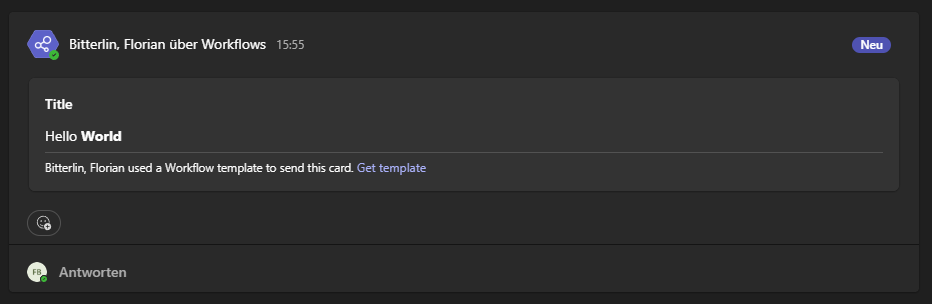

[](https://github.com/baloise-incubator/ms-teams-connector/actions/workflows/ci.yml)
[](https://sonarcloud.io/dashboard?id=baloise-incubator_ms-teams-connector)


# ms-teams-connector

Utilize a [AdaptiveCard](https://adaptivecards.microsoft.com/?topic=AdaptiveCard) 
and publish it to a MS-Teams channel via webhook workflow.

Special thanks goes to <a href="https://github.com/luechtdiode" target="_blank"><b>Roland Seidel</b></a> for the idea and his reference implementation.

## Change Log

- version 0.6.0 provides message format wrapper to publish in MS Teams
- Version 0.5.0
  - support blocking thread executor for batch / cli usage
  - ⚠️ __Breaking__: removed deprecated config parameter
- Version 0.4.0 is the first version supporting AdaptiveCards
- Version 0.2.3 is the last version supporting Java 8


## Usage

#### Create a webhook workflow that posts cards in teams


#### Add dependency to your project

```xml
<dependency>
  <groupId>com.baloise.open</groupId>
  <artifactId>ms-teams-connector</artifactId>
  <version>0.6.0</version>
</dependency>
```

#### Create publisher per channel

```java
final String uri = "webhook_url";
final MessagePublisher channelPublisher = MessagePublisher.getInstance(uri);
```

Now you can publish any message using MessagePublisher (e.g., create and publish a simple message)
```java
final var card = AdaptiveCardFactory.createSimpleAdaptiveCard("Title 2", "Hello **World**");
final var msg = TeamsMessageFactory.createTeamsMessageWithAdaptiveCard("Title 2", card);
final ScheduledFuture<?> scheduledFuture = MessagePublisher.getInstance(proxy, uri).publish(msg);
```



#### Using MessageCardFactory builder

MessageCardFactory builder extends the "_SimpleMessageCard_" by adding facts. Facts are key-value pairs added as table below the text.

```java
AdaptiveCardFactory.builder("A crisp title", "A little more descriptive text.")
    .withFact("Status", "Failure")
    .withFact("Reason", "Out of memory")
    .build();
```

## CLI Usage (ConnectorApplication)

A standalone shaded application is provided so you can publish a card without writing any Java code. You only set environment variables and run the jar.

### Build the executable jar

Use Maven to build the shaded application jar (classifier `app`).

### Required environment variables

| Name | Description |
|------|-------------|
| WEBHOOK_URL | Teams incoming webhook URL (target channel). |
| MESSAGE_TITLE | Card title. |
| MESSAGE_TEXT | Markdown body text of the card. |

### Optional environment variables

| Name | Description | Default |
|------|-------------|---------|
| MESSAGE_SUMMARY | Short textual summary (shown in notifications). | none |
| MESSAGE_THEME_COLOR | Hex or named color (Teams may map it). | none |
| RETRIES | Number of publish retries (>0). Invalid values are ignored. | 3 |
| RETRY_PAUSE_SEC | Pause between retries in seconds (>0). Invalid values are ignored. | 60 |
| https_proxy / HTTPS_PROXY | Proxy URL if outbound traffic requires a proxy. | none |

Notes:
- Invalid integer values for RETRIES / RETRY_PAUSE_SEC are ignored with a warning; defaults are used.
- RETRY_PAUSE_SEC is interpreted in seconds; internally it is converted to milliseconds.

### Exit codes

| Code | Meaning |
|------|---------|
| 0 | Success: publish job was initialized. |
| 2 | Validation error: one or more required environment variables missing. |

Other issues (e.g. network failures) surface via log output; retries will occur automatically.

### Mapping: Environment vs Config properties

| Environment | Config Property | Notes |
|-------------|-----------------|-------|
| WEBHOOK_URL | PROPERTY_WEBHOOK_URI | Mandatory in both. |
| RETRIES | PROPERTY_RETRIES | Positive integer. |
| RETRY_PAUSE_SEC | PROPERTY_RETRY_PAUSE | Seconds. Internally converted to ms. |
| https_proxy / HTTPS_PROXY | PROPERTY_PROXY_URI | CLI uses environment; property ignored. |
| (none) | PROPERTY_BLOCKING | CLI always performs a short non-blocking wait (internal Awaitility poll). |

If you need finer control (blocking behavior, programmatic composition) use the library API instead of the CLI.

## Configuration

| Parameter            | Default | Description                                                                                                                               |
|----------------------|---------|-------------------------------------------------------------------------------------------------------------------------------------------|
| PROPERTY_RETRIES     | 3       | Defines the number of retries to publish the message in case of unsuccessful answer from webhook. Accepts any positive integer > 0.       |
| PROPERTY_RETRY_PAUSE | 60      | Defines the pause time between PROPERTY_RETRIES in seconds. Accepts any positive integer > 0.                                             |
| PROPERTY_WEBHOOK_URI | none    | The URI to your webhook. Required property provided either as String or URI.                                                              |
| PROPERTY_PROXY_URI   | none    | The URI to your web proxy.                                                                                                                |
| PROPERTY_BLOCKING    | false   | Set to ___true___ to block main thread until message was sent or max retries time is reached. Default is sending messages asynchronously. |

### System Environment

Alternatively you can also specify a system environment variable named ``https_proxy`` to connect via a proxy URL. 
